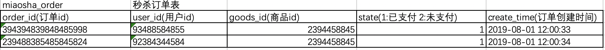
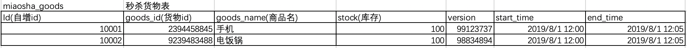
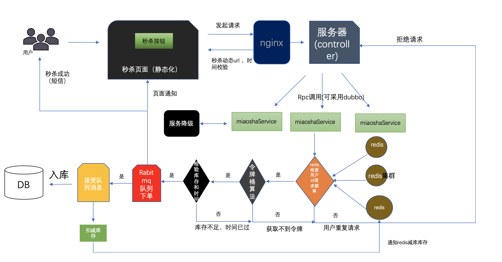

# 1.什么是秒杀系统

通俗一点讲就是网络商家为促销等目的组织的网上限时抢购活动

比如说京东秒杀，就是一种定时定量秒杀，在规定时间内，无论商品是否秒杀完毕，该场次的秒杀活动都会结束。这种秒杀，对时间不是特别严格，只要是下手快，秒中的概率就比较大。

# 2.秒杀系统的业务特点

## 瞬时并发量大

秒杀时会有大量用户在同一时间进行抢购，瞬时并发访问量很大。

## 库存量少

一般秒杀活动的商品量很少，这就导致了只有极少数的用户可以成功购买到商品。

## 业务简单

流程比较简单，一般都是下订单、扣库存、支付订单。

# 3.秒杀应该考虑的问题

## 3.1 超卖问题

分析秒杀的业务场景，最重要的一点就是超卖问题。假如备货只有 100件，但是最终卖了 200 件，一般来讲秒杀系统的价格都比较低，如果超卖将严重影响公司的财产利益，因此首当其冲的就是解决超卖的问题。

## 3.2 高并发

秒杀具有时间短、并发量大的特点，秒杀持续的时间只有几秒到几分钟。因为商品的价格极低，就会有很多用户参与抢购。在极端的时间内，同时有几万到几十万的请求同时进来，后端如何防止高并发造成的缓存击穿或者失效，击垮数据库都是需要考虑的问题。

## 3.3 接口防刷

现在的秒杀系统大多数都会出来针对秒杀的对应软件，这类软件会模拟不断向后台服务器发送请求，一秒几百次都是很常见的，如何防止这类软件的重复无效请求，防止不断发起的请求也是需要我们针对性的考虑的。

## 3.4 秒杀 URL

稍微有技术功底的用户，可以通过查看秒杀的 url，通过特定软件去请求也可以实现秒杀。或者提前知道秒杀的 URL 的人，一请求就直接实现了秒杀了。

## 3.5 数据库设计

秒杀有把我们服务器击垮的风险，如果让它与我们的其他业务使用在同一个数据库中，耦合在一起，就很有可能牵连和影响其他的业务。如何防止这类问题发生，就算秒杀发生了宕机、服务器卡死问题，也应该让他尽量不影响线上正常进行的业务。

## 3.6 大量请求问题

如何承载这样巨大的访问量，同时提供稳定低时延的服务保证，是需要面对的一大挑战，如果使用的是 Redis 缓存，单台 Redis 服务器可承受的 QPS 大概是 4W 左右，如果一个秒杀吸引的用户量足够多的话，单 QPS 可能达到几十万，单体 Redis 还是不足以支撑如此巨大的请求量。缓存会被击穿，直接渗透到 DB，从而击垮 MySQL。

# 4.秒杀系统的设计和技术方案

## 4.1 秒杀系统数据库设计

从上面提出的问题，我们应该单独设计一个秒杀数据库，防止因此秒杀活动的高并发访问拖垮整个网站。这里只需要两站表，一张是秒杀订单表，一张是秒杀货品表：

其实应该还有几张表，商品表：可以关联goods_id查到具体的商品信息，商品图像、名称、平时价格、秒杀价格等，还有用户表：根据用户user_id可以查询到用户昵称、用户手机号，收货地址等其他额外信息，这个具体就不给出实例了。

## 4.2 精简SQL

典型的一个场景是在进行扣减库存的时候，传统的做法就是先查询库存，再去 UPDATE。这样的话需要两个 SQL，而实际上一个 SQL 我们就可以完成的。可以用这样的做法：UPDATE miaosha_goods set stock=stock-1 where goods_id=#{goods_id} and version=#{version} and stock>0；这样的话，就可以保证库存不会超卖并且一次更新库存，还有注意一点这里使用了版本号的乐观锁，相比较悲观锁，它的性能较好。

## 4.3 秒杀 URL 的设计

为了避免有程序访问经验的人通过下单页面 URL 直接访问后台接口来秒杀货品，我们需要将秒杀的 URL 实现动态化，即使是开发整个系统的人都无法在秒杀开始前直到秒杀的 URL。具体的做法就是通过 md5 加密一串随机字符作为秒杀的 URL，然后前端访问后台获取具体的 URL，后台校验通过以后才可以继续秒杀。

## 4.4 秒杀页面静态化

将商品的描述、参数、成交记录、图像、评价等全部写入一个静态页面，用户请求不需要通过访问后端服务器，不需要经过数据库，直接在前台客户端生成，这样可以最大可能的减少服务器的压力。具体的方法可以使用 freemarker 模板技术，建立网页模板，填充数据，然后渲染网页。

## 4.5 单体 Redis 升级为集群 Redis

秒杀是一个读多写少的场景，使用 Redis 做缓存再合适不过。不过考虑到缓存击穿问题，我们应该构建 Redis 集群，采用哨兵模式，可以提升 Redis 的性能和可用性。

## 4.6 使用 Nignx

Nignx 是一个高性能 WEB 服务器，它的并发能力可以到达几万，而 Tomcat 只有几百。通过 Nignx 映射客户端请求，再分发到后台 Tomcat 服务器集群中可以大大提升并发能力。

## 4.7 Redis 预减库存

很多请求进来，都需要后台查询库存，这是一个频繁读的场景。可以使用 Redis 来预减库存，在秒杀开始前可以在 Redis 设值，比如 redis.set(goodsId, 100)（这里预放的库存为 100 可以设置为常量），每次下单成功之后，Integer stock = (Integer) redis.get(goodsId)；然后判断 stock 的值，如果小于常量值就减 1，如果取消的时候，需要增加库存。增加库存的时候以得注意不能大于之前设置的总库存数（查询库存和扣减库存需要原子操作，此时可以借助 Lua 脚本）下次再获取库存的时候，直接从 Redis 里面查就可以了。

## 4.8 接口限流

秒杀最终的本质是数据库的更新，但是有很多大量无效的请求，我们最终要做的就是如何把这些无效的请求过滤掉，防止渗透到数据库。

## 4.9 前端限流

用户在秒杀按钮点击以后发起请求，那么在接下来的 5 秒是无法点击（通过设置按钮为 disable）。

## 4.10 同一用户的重复请求

通过 Redis 的键过期策略，首先对每个请求都从 String value = redis.get(userId)；如果获取这个 value 为空或者为 null，表示它是有效请求，然后放行这个请求，然后放行这个请求。如果不为空表示它是重复性请求，直接丢掉这个请求。如果有效，采用 redis.setexpire(userId, value, 10).value 可以是任意值，一般放业务属性比较好，这个是设置以 userId 为key，10 秒的过期时间（10 秒后，key 对应的值自动为 null）。

## 4.11 令牌桶算法限流

令牌桶算法的基本思想是每个请求尝试获取一个令牌，后端只处理持有令牌的请求，生产令牌的速度和效率我们都可以自己限定，guava 提供了 RateLimter 的 api 供我们使用。

## 4.12 异步下单

为了提升下单的效率，并且防止下单服务的失败。需要将下单这一操作进行异步处理。最常采用的办法是使用队列，队列最显著的三个优点：异步、削峰、解耦。这里可以采用 RabbitMQ，在后台经过了限流、库存校验之后，流入到这一步骤的就是有效请求。然后发送到队列里，队列接收消息，异步下单。下完单，入库没有问题可以用短信通知用户秒杀成功。假如失败的话，可以采用补偿机制，重点。

## 4.13 服务降级

假如在秒杀过程中出现了某个服务器宕机，或者服务不可用，应该做好后备工作。可以通过 Hystrix 进行服务熔断和降级，可以开发一个备用服务，假如服务器真的宕机了，直接给用户一个友好的提示返回。

# 5.秒杀系统流程图

# 参考文献：

---

1. [https://zhuanlan.zhihu.com/p/76612241?utm_source=wechat_session](https://zhuanlan.zhihu.com/p/76612241?utm_source=wechat_session)
2. [https://blog.51cto.com/13527416/2085258#h1](https://blog.51cto.com/13527416/2085258#h1)